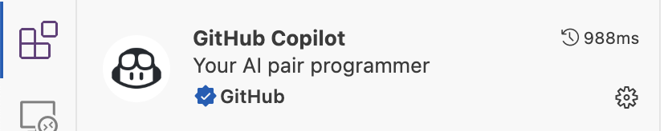
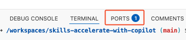

# Getting Started with GitHub Copilot

Hey sreenadh02Nov!

Mona here. I'm done preparing your exercise. Hope you enjoy! 💚

Remember, it's self-paced so feel free to take a break! ☕️

---

&copy; 2025 GitHub &bull; [Code of Conduct](https://www.contributor-covenant.org/version/2/1/code_of_conduct/code_of_conduct.md) &bull; [MIT License](https://gh.io/mit)

## Images (screenshots)

Here are the screenshots used in the exercise. They are stored in the repository under `.github/images/`.

- **Copilot extension banner**

	

	Extracted text (OCR):

	- GitHub Copilot
	- Your AI pair programmer
	- GitHub
	- 988ms

- **Ask mode selection**

	

- **Toggle chat icon**

	

- **Run and Debug tab**

	

- **Open in browser icon**

	

If you'd like these images optimized (WebP) or moved into a docs folder, tell me which option you prefer and I can update the repo accordingly.

